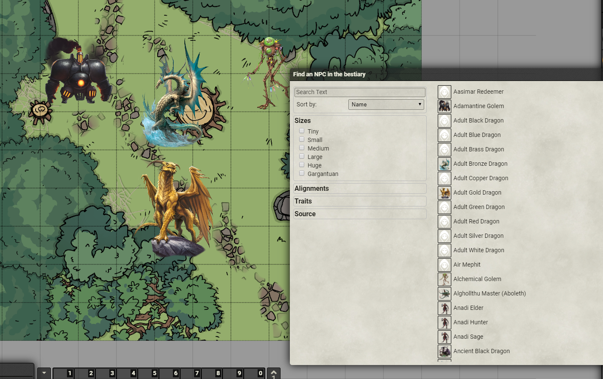

# PF2 Monster Foundry Importer

This tool is for importing monster images into FoundryVTT. This is an easy to use Electron App that is designed to be easy to use.

Here's a sample after running the tool.

Step 1: Run `yarn start`

Step 2: Select the pathfinder-bestiary.db inside of the Foundry App Data (typically AppData/Local/Foundry/Data/systems/pf2e/packs/pathfinder-bestiary.db).

Step 3: Select the image directory folder. The files in the image direction folder must be named with IDs to match the Nethys Monster IDs. i.e. https://2e.aonprd.com/Monsters.aspx?ID=48 would map to 48.png (Grizzly Bear). (This images can come from anywhere so if you want a custom image, just add it to the folder and name it XXX.png)

Step 4: Copy your image directory to AppData/Foundry/systems/pf2e/monsters/

Step 5: Generate new Foundry DB. Download the file and replace your old pathfinder-bestiary.db from Step 1. Restart Foundry and enjoy!
